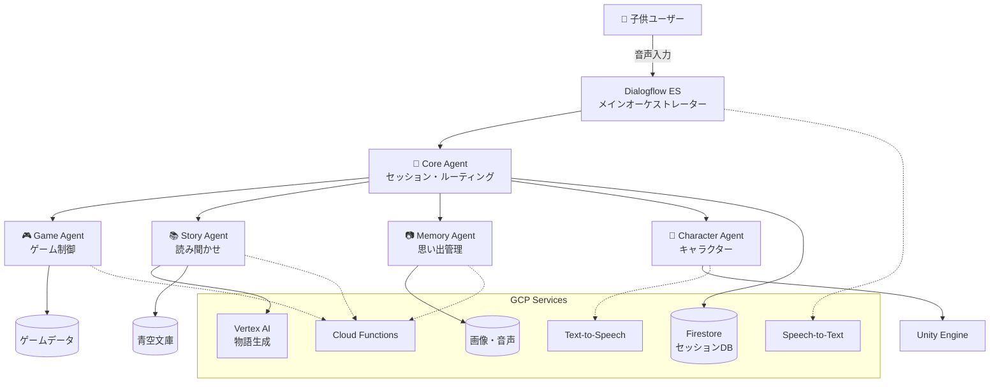

# Agent設計書 - 子供見守りアプリ

## 1. Agent設計概要

### 1.1 システム全体像
子供見守りWebアプリは、複数の専門Agentが連携してインタラクティブな体験を提供します。各Agentは特定の役割を持ち、Dialogflow ESを中心としたオーケストレーションで統合され、PWA技術によりネイティブアプリ並みの体験を実現します。

### 1.2 設計原則
- **モジュラー設計**: 各機能を独立したAgentとして実装
- **スケーラビリティ**: 機能追加が容易な疎結合アーキテクチャ
- **リアルタイム性**: 子供との自然な対話を重視
- **安全性**: 子供向けコンテンツの品質管理

---

## 2. Agent構成

### 2.1 Core Agent（中央制御）
**役割**: システム全体の制御・ルーティング・セッション管理

**主要機能**:
- ユーザー認証・セッション管理
- 各機能Agentへのルーティング
- タイマー・休憩管理
- 使用状況ログ収集

**技術スタック**:
- Dialogflow ES (メインフロー)
- Cloud Functions (Node.js)
- Firestore (セッションデータ)
- WebSocket (リアルタイム通信)

### 2.2 Game Agent（ゲーム制御）
**役割**: しりとり・なぞなぞ・歌ゲームの実行

**主要機能**:
```
しりとりAgent:
- 単語の妥当性チェック
- しりとりルール管理
- 難易度調整

なぞなぞAgent:
- 年齢適正なぞなぞ出題
- ヒント生成・管理
- 正解判定

歌・ダンスAgent:
- 楽曲選択・再生制御
- キャラクターアニメーション制御
- 歌詞表示・ガイド
```

**技術スタック**:
- Cloud Functions (Python)
- Custom Knowledge Base (Firestore)
- Cloud Text-to-Speech

### 2.3 Story Agent（読み聞かせ制御）
**役割**: 物語生成・読み聞かせ・絵本表示

**主要機能**:
- 青空文庫コンテンツ管理
- AI物語生成（Vertex AI）
- パーソナライズストーリー作成
- 音声朗読・ページめくり制御
- キャラクター生成・アニメーション

**技術スタック**:
- Vertex AI (Gemini Pro)
- Cloud Text-to-Speech
- Imagen API (画像生成)
- Cloud Storage (コンテンツ保存)

### 2.4 Memory Agent（思い出・記録管理）
**役割**: 写真撮影・加工・アルバム・感想記録

**主要機能**:
- 写真撮影・画像処理
- 感想音声録音・保存
- アルバム生成・管理
- 共有機能（家族間）
- スタンプ・報酬システム

**技術スタック**:
- Web Camera API (ブラウザカメラ)
- Canvas API (画像処理)
- Cloud Vision API (画像解析)
- Cloud Storage (画像・音声保存)
- Cloud Functions (画像処理)
- Firebase Authentication (共有機能)

### 2.5 Character Agent（キャラクター制御）
**役割**: ピンクうさぎキャラクターの表情・動作・発話

**主要機能**:
- 感情表現・表情変化
- 状況に応じたアニメーション
- 自然な発話タイミング制御
- パーソナライズされた反応

**技術スタック**:
- Three.js/WebGL (3Dキャラクター描画)
- CSS Animations/Web Animations API
- Cloud Functions (感情分析)
- Cloud Text-to-Speech (音声生成)
- WebRTC (音声処理)

---

## 3. Agent間連携アーキテクチャ

### 3.1 システム構成図



### 3.2 データフロー

**1. セッション開始フロー**
```
音声「見守り開始」 
→ Dialogflow ES 
→ Core Agent (セッション作成)
→ Character Agent (うさぎ登場)
→ 「どんなゲームで遊ぶ？」
```

**2. ゲーム実行フロー**
```
ゲーム選択 
→ Core Agent 
→ Game Agent (該当ゲーム起動)
→ Character Agent (表情・動作)
→ ゲーム進行
```

**3. 読み聞かせフロー**
```
読み聞かせ選択 
→ Story Agent 
→ Vertex AI (物語生成/選択)
→ Character Agent (朗読・アニメーション)
→ Memory Agent (記録保存)
```

---

## 4. エンジニア分担計画

### 4.1 分担方針
- **フロントエンド・UI重視**: Engineer A
- **バックエンド・AI重視**: Engineer B
- **並行開発**: 両エンジニアが独立して進められる設計

### 4.2 Engineer A の担当範囲

#### 🎨 **Frontend & UI系Agent**
```
担当Agent:
✅ Character Agent (ピンクうさぎ)
✅ Memory Agent (写真・UI部分)
✅ Core Agent (UI制御部分)

主要技術:
- Android Native (Kotlin)
- Jetpack Compose
- Unity (キャラクター描画)
- CameraX (写真撮影)
- Firebase SDK
```

#### 📱 **具体的な実装項目**
1. **メインUI設計**
   - 音声入力画面
   - ゲーム選択画面
   - 設定・アルバム画面

2. **キャラクターシステム**
   - ピンクうさぎの3Dモデル
   - 表情・感情アニメーション
   - 音声同期リップシンク

3. **カメラ・写真機能**
   - 写真撮影UI
   - 画像加工・フィルター
   - アルバム表示

4. **ローカルデータ管理**
   - アプリ設定
   - キャッシュ管理
   - オフライン対応

### 4.3 Engineer B の担当範囲

#### 🔧 **Backend & AI系Agent**
```
担当Agent:
✅ Game Agent (全ゲームロジック)
✅ Story Agent (AI生成・読み聞かせ)
✅ Core Agent (サーバー側ロジック)
✅ Memory Agent (サーバー側処理)

主要技術:
- Google Cloud Functions
- Dialogflow ES
- Vertex AI (Gemini Pro)
- Cloud Speech/Text-to-Speech
- Firestore
```

#### ⚙️ **具体的な実装項目**
1. **対話エンジン**
   - Dialogflow ES設定
   - インテント・エンティティ定義
   - コンテキスト管理

2. **ゲームロジック**
   - しりとりエンジン
   - なぞなぞデータベース
   - 楽曲管理システム

3. **AI物語生成**
   - Vertex AI連携
   - プロンプトエンジニアリング
   - コンテンツフィルタリング

4. **データ管理**
   - Firestore設計
   - Cloud Storage管理
   - 使用状況分析

---

## 5. 開発フェーズ・タイムライン

### 5.1 Phase 1: 基盤構築 (Day 1-2)

#### Engineer A
- [ ] Android プロジェクト設定
- [ ] 基本UI フレームワーク構築
- [ ] 音声入力UI実装
- [ ] キャラクター基本表示

#### Engineer B  
- [ ] GCP プロジェクト設定
- [ ] Dialogflow ES 基本設定
- [ ] Cloud Functions 環境構築
- [ ] Firestore スキーマ設計

### 5.2 Phase 2: MVP機能実装 (Day 3-4)

#### Engineer A
- [ ] ピンクうさぎアニメーション
- [ ] 基本ゲームUI（しりとり）
- [ ] 写真撮影機能
- [ ] 音声録音UI

#### Engineer B
- [ ] しりとりゲームロジック
- [ ] 基本読み聞かせ機能
- [ ] 音声認識・合成連携
- [ ] セッション管理

### 5.3 Phase 3: 拡張機能 (Day 5-6)

#### Engineer A
- [ ] なぞなぞ・歌ゲームUI
- [ ] アルバム機能
- [ ] 高度なアニメーション
- [ ] UI/UXブラッシュアップ

#### Engineer B
- [ ] AI物語生成
- [ ] 高度なゲーム機能
- [ ] スタンプ・報酬システム
- [ ] 分析・ログ機能

### 5.4 Phase 4: 統合・テスト (Day 7)

#### 両エンジニア協力
- [ ] システム統合テスト
- [ ] パフォーマンス最適化
- [ ] バグ修正
- [ ] デモ準備

---

## 6. Agent間通信仕様

### 6.1 共通データ形式

```json
{
  "sessionId": "string",
  "userId": "string", 
  "timestamp": "ISO8601",
  "agentType": "core|game|story|memory|character",
  "action": "string",
  "payload": {},
  "context": {
    "currentActivity": "string",
    "emotionalState": "string",
    "timeRemaining": "number"
  }
}
```

### 6.2 主要API エンドポイント

#### Core Agent API
```
POST /api/session/start
POST /api/session/end  
GET  /api/session/status
POST /api/routing/{agent}
```

#### Game Agent API
```
POST /api/game/shiritori/start
POST /api/game/shiritori/check
POST /api/game/riddle/generate
POST /api/game/song/select
```

#### Story Agent API
```
POST /api/story/generate
GET  /api/story/library
POST /api/story/narrate
```

#### Memory Agent API
```
POST /api/memory/photo/capture
POST /api/memory/voice/record
GET  /api/memory/album
POST /api/memory/share
```

#### Character Agent API
```
POST /api/character/emotion
POST /api/character/animation
POST /api/character/speech
```

---

## 7. 技術的考慮事項

### 7.1 リアルタイム性の確保
- **WebSocket接続**: キャラクターアニメーション同期
- **ストリーミング**: 音声認識・合成のリアルタイム処理
- **キャッシング**: よく使われるコンテンツの事前読み込み

### 7.2 エラーハンドリング
- **グレースフルフォールバック**: AI生成失敗時の代替コンテンツ
- **ネットワーク断**: オフライン時の基本機能継続
- **音声認識失敗**: ビジュアル選択肢への切り替え

### 7.3 セキュリティ・プライバシー
- **データ暗号化**: 子供の音声・画像の保護
- **コンテンツフィルタリング**: 不適切コンテンツの自動検出
- **アクセス制御**: 保護者による設定管理

---

## 8. 監視・運用

### 8.1 監視項目
- **レスポンス時間**: 各Agent の応答速度
- **成功率**: 音声認識・AI生成の成功率
- **利用状況**: 機能別利用頻度・継続時間

### 8.2 ログ設計
```json
{
  "eventType": "user_interaction|system_event|error",
  "agent": "string",
  "function": "string", 
  "duration": "number",
  "success": "boolean",
  "errorDetails": "string",
  "userContext": {}
}
```

---

## 9. 今後の拡張計画

### 9.1 追加Agent候補
- **Learning Agent**: 学習進度管理・適応学習
- **Social Agent**: 他の子供との安全な交流
- **Health Agent**: 姿勢・目の健康管理
- **Parent Agent**: 保護者向けレポート・設定

### 9.2 機能拡張
- **多言語対応**: 英語学習機能
- **AR/VR対応**: より没入感のある体験
- **IoT連携**: スマートホーム機器との連動

---

この設計により、エンジニア2名で効率的に開発を進められ、将来の機能拡張にも対応できる柔軟なAgent システムを構築できます。
