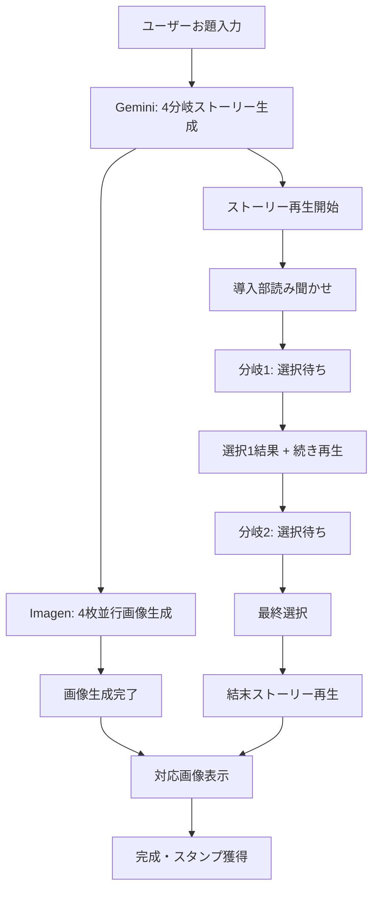

# Gemini ADK・Vertex AI 絵本作成システム設計

## 🎯 システム概要

### 基本フロー
```
ユーザーお題入力 → Gemini で4分岐ストーリー生成 → ストーリー再生開始
                ↓ (並行処理)
         Vertex AI Imagen で4枚画像生成 → 選択された結末の画像表示
```

### 対象ユーザー
- **メインユーザー**: 幼稚園児（3-6歳）
- **コンテンツ基準**: 年齢適正、教育的価値、ハッピーエンド必須

---

## 📖 ストーリー生成アーキテクチャ

### 1. Gemini ADK によるストーリー生成

#### プロンプト設計
```python
STORY_GENERATION_PROMPT = """
あなたは幼稚園児向けの物語作家です。以下の条件で物語を作成してください：

【条件】
- 対象年齢：3-6歳の幼稚園児
- お題：{user_topic}
- 構造：導入 → 分岐1（2択） → 分岐2（2択） → 4つの結末
- 全ての結末：ハッピーエンド必須
- 文体：ひらがな多め、優しい表現
- 長さ：各段落50-80文字程度

【出力形式】
```json
{
  "title": "物語のタイトル",
  "introduction": "導入部分のテキスト",
  "first_choice": {
    "situation": "最初の選択場面の説明",
    "option_a": "選択肢A",
    "option_b": "選択肢B"
  },
  "branches": {
    "a": {
      "story": "選択肢Aの展開",
      "second_choice": {
        "situation": "2回目の選択場面",
        "option_a": "選択肢A-A",
        "option_b": "選択肢A-B"
      }
    },
    "b": {
      "story": "選択肢Bの展開", 
      "second_choice": {
        "situation": "2回目の選択場面",
        "option_a": "選択肢B-A",
        "option_b": "選択肢B-B"
      }
    }
  },
  "endings": {
    "aa": {
      "story": "結末A-A（ハッピーエンド）",
      "lesson": "学べること",
      "image_prompt": "画像生成用プロンプト（英語）"
    },
    "ab": {
      "story": "結末A-B（ハッピーエンド）",
      "lesson": "学べること", 
      "image_prompt": "画像生成用プロンプト（英語）"
    },
    "ba": {
      "story": "結末B-A（ハッピーエンド）",
      "lesson": "学べること",
      "image_prompt": "画像生成用プロンプト（英語）"
    },
    "bb": {
      "story": "結末B-B（ハッピーエンド）",
      "lesson": "学べること",
      "image_prompt": "画像生成用プロンプト（英語）"
    }
  }
}
```
"""
```

#### 実装サンプル
```javascript
// Gemini ADK でストーリー生成
async function generateStoryWithGemini(userTopic) {
    const prompt = STORY_GENERATION_PROMPT.replace('{user_topic}', userTopic);
    
    const response = await fetch('/api/generate-story', {
        method: 'POST',
        headers: {
            'Content-Type': 'application/json',
        },
        body: JSON.stringify({
            prompt: prompt,
            model: 'gemini-1.5-pro',
            temperature: 0.8,
            maxTokens: 2000
        })
    });
    
    const storyData = await response.json();
    return storyData;
}
```

---

## 🖼️ 画像生成システム

### 2. Vertex AI Imagen による並行画像生成

#### 画像生成戦略
```python
# 4つの結末に対応する画像を並行生成
async def generate_all_ending_images(story_data):
    image_tasks = []
    
    for ending_key, ending_data in story_data['endings'].items():
        task = generate_image_async(
            prompt=ending_data['image_prompt'],
            style="children's book illustration, soft colors, friendly characters",
            safety_filter=True,
            aspect_ratio="4:3"
        )
        image_tasks.append((ending_key, task))
    
    # 並行実行
    results = await asyncio.gather(*[task for _, task in image_tasks])
    
    return {
        ending_key: result 
        for (ending_key, _), result in zip(image_tasks, results)
    }
```

#### 画像プロンプト最適化
```python
def optimize_image_prompt(base_prompt, story_context):
    """幼稚園児向け絵本のための画像プロンプト最適化"""
    
    style_prefix = """
    Children's book illustration, watercolor style, soft pastel colors,
    friendly cartoon characters, safe and comforting atmosphere,
    no scary elements, bright and cheerful,
    """
    
    safety_suffix = """
    , G-rated content, appropriate for ages 3-6,
    no violence, no dark themes, wholesome and educational
    """
    
    optimized_prompt = f"{style_prefix} {base_prompt} {safety_suffix}"
    return optimized_prompt
```

---

## ⚡ 効率化システム設計

### 3. 並行処理フロー



### 4. タイミング最適化

```javascript
class StoryBookEngine {
    constructor() {
        this.storyData = null;
        this.generatedImages = {};
        this.currentPath = '';
        this.imageGenerationProgress = {};
    }
    
    async createStoryBook(userTopic) {
        // Step 1: Gemini でストーリー生成
        console.log('📖 AIが物語を考えています...');
        this.storyData = await this.generateStoryWithGemini(userTopic);
        
        // Step 2: 画像生成を並行開始（バックグラウンド）
        console.log('🎨 特別な絵を準備中...');
        this.startImageGenerationInBackground();
        
        // Step 3: すぐにストーリー再生開始
        console.log('🎭 物語スタート！');
        this.startStoryPlayback();
    }
    
    async startImageGenerationInBackground() {
        const endings = this.storyData.endings;
        
        // 4つの画像を並行生成
        for (const [endingKey, endingData] of Object.entries(endings)) {
            this.generateEndingImage(endingKey, endingData.image_prompt);
        }
    }
    
    async generateEndingImage(endingKey, basePrompt) {
        this.imageGenerationProgress[endingKey] = 0;
        
        try {
            const optimizedPrompt = this.optimizeImagePrompt(basePrompt);
            
            // プログレス更新をシミュレート
            const progressInterval = setInterval(() => {
                this.imageGenerationProgress[endingKey] += Math.random() * 15;
                if (this.imageGenerationProgress[endingKey] > 90) {
                    this.imageGenerationProgress[endingKey] = 90;
                }
                this.updateImageProgress();
            }, 500);
            
            // 実際の画像生成
            const imageUrl = await this.callVertexAIImagen(optimizedPrompt);
            
            clearInterval(progressInterval);
            this.imageGenerationProgress[endingKey] = 100;
            this.generatedImages[endingKey] = imageUrl;
            
            console.log(`🖼️ 結末${endingKey}の画像完成！`);
            
        } catch (error) {
            console.error(`画像生成エラー (${endingKey}):`, error);
            // フォールバック画像を使用
            this.generatedImages[endingKey] = this.getDefaultImage(endingKey);
        }
    }
    
    selectChoice(choice, isFirstChoice) {
        if (isFirstChoice) {
            this.currentPath = choice; // 'a' or 'b'
        } else {
            this.currentPath += choice; // 'aa', 'ab', 'ba', 'bb'
            this.prepareEnding();
        }
    }
    
    async prepareEnding() {
        const endingKey = this.currentPath;
        const ending = this.storyData.endings[endingKey];
        
        // 対応する画像が準備できているかチェック
        if (!this.generatedImages[endingKey]) {
            console.log('🖼️ 特別な絵を仕上げています...');
            await this.waitForImageGeneration(endingKey);
        }
        
        this.showEnding(ending, this.generatedImages[endingKey]);
    }
    
    async waitForImageGeneration(endingKey, maxWait = 30000) {
        const startTime = Date.now();
        
        while (!this.generatedImages[endingKey] && 
               Date.now() - startTime < maxWait) {
            await new Promise(resolve => setTimeout(resolve, 500));
        }
        
        // タイムアウトの場合はデフォルト画像
        if (!this.generatedImages[endingKey]) {
            this.generatedImages[endingKey] = this.getDefaultImage(endingKey);
        }
    }
}
```

---

## 🎨 画像生成詳細仕様

### 5. Vertex AI Imagen 設定

```python
# Cloud Functions での実装例
import vertexai
from vertexai.preview.vision_models import ImageGenerationModel

def generate_story_image(request):
    """Cloud Function for image generation"""
    
    # Vertex AI 初期化
    vertexai.init(project="your-project-id", location="us-central1")
    
    model = ImageGenerationModel.from_pretrained("imagegeneration@005")
    
    # リクエストデータ
    data = request.get_json()
    base_prompt = data.get('prompt', '')
    ending_type = data.get('ending_type', 'aa')
    
    # 幼稚園児向けプロンプト最適化
    optimized_prompt = f"""
    {base_prompt}
    
    Style: Children's book illustration, watercolor painting, soft pastel colors,
    friendly cartoon characters, warm and cozy atmosphere, hand-drawn feel,
    professional children's book quality
    
    Characters: Cute, round, friendly faces with big eyes, simple design,
    expressive but not overly detailed
    
    Setting: Bright, colorful, safe environment, natural outdoor scenes or
    cozy indoor spaces, appropriate for young children
    
    Mood: Happy, optimistic, peaceful, encouraging, educational value
    
    Technical: High quality, clean composition, balanced colors,
    4:3 aspect ratio, suitable for digital display
    
    Safety: G-rated content, no scary elements, no violence,
    no inappropriate content, wholesome and educational
    """
    
    try:
        # 画像生成実行
        response = model.generate_images(
            prompt=optimized_prompt,
            number_of_images=1,
            aspect_ratio="4:3",
            safety_filter_level="block_most",
            person_generation="allow_adult"
        )
        
        # 画像をCloud Storageに保存
        image_url = save_to_cloud_storage(response.images[0], ending_type)
        
        return {
            'status': 'success',
            'image_url': image_url,
            'ending_type': ending_type
        }
        
    except Exception as e:
        return {
            'status': 'error',
            'message': str(e),
            'fallback_image': get_fallback_image(ending_type)
        }

def save_to_cloud_storage(image, ending_type):
    """生成画像をCloud Storageに保存"""
    from google.cloud import storage
    
    client = storage.Client()
    bucket = client.bucket('your-storybook-images')
    
    # ユニークなファイル名生成
    import uuid
    filename = f"story_ending_{ending_type}_{uuid.uuid4().hex}.png"
    
    blob = bucket.blob(f"generated_images/{filename}")
    blob.upload_from_string(image._image_bytes, content_type='image/png')
    
    # 公開URLを返す
    return f"https://storage.googleapis.com/your-storybook-images/generated_images/{filename}"
```

---

## 📱 フロントエンド実装

### 6. React/Vue.js でのUI実装

```jsx
// React での実装例
import React, { useState, useEffect } from 'react';

const AIStoryBookCreator = () => {
    const [storyEngine] = useState(new StoryBookEngine());
    const [currentStage, setCurrentStage] = useState('input'); // input, generating, playing, ending
    const [storyData, setStoryData] = useState(null);
    const [currentPath, setCurrentPath] = useState('');
    const [imageProgress, setImageProgress] = useState({});
    
    const createStoryBook = async (userTopic) => {
        setCurrentStage('generating');
        
        try {
            await storyEngine.createStoryBook(userTopic);
            setStoryData(storyEngine.storyData);
            setCurrentStage('playing');
        } catch (error) {
            console.error('ストーリー生成エラー:', error);
            // エラーハンドリング
        }
    };
    
    const makeChoice = (choice, isFirstChoice) => {
        storyEngine.selectChoice(choice, isFirstChoice);
        
        if (isFirstChoice) {
            setCurrentPath(choice);
        } else {
            setCurrentPath(currentPath + choice);
            setCurrentStage('ending');
        }
    };
    
    return (
        <div className="ai-storybook-creator">
            {currentStage === 'input' && (
                <StoryTopicInput onSubmit={createStoryBook} />
            )}
            
            {currentStage === 'generating' && (
                <GenerationProgress 
                    storyProgress={storyEngine.storyProgress}
                    imageProgress={imageProgress}
                />
            )}
            
            {currentStage === 'playing' && storyData && (
                <InteractiveStoryPlayer 
                    storyData={storyData}
                    onChoice={makeChoice}
                />
            )}
            
            {currentStage === 'ending' && (
                <StoryEnding 
                    endingData={storyData.endings[currentPath]}
                    generatedImage={storyEngine.generatedImages[currentPath]}
                />
            )}
        </div>
    );
};

const StoryTopicInput = ({ onSubmit }) => {
    const [topic, setTopic] = useState('');
    
    const handleSubmit = (e) => {
        e.preventDefault();
        if (topic.trim()) {
            onSubmit(topic.trim());
        }
    };
    
    return (
        <div className="topic-input-container">
            <h2>🎭 どんなお話にする？</h2>
            <form onSubmit={handleSubmit}>
                <div className="input-suggestions">
                    <p>例：</p>
                    <button type="button" onClick={() => setTopic('動物たちの冒険')}>
                        🐾 動物たちの冒険
                    </button>
                    <button type="button" onClick={() => setTopic('魔法の森')}>
                        🌟 魔法の森
                    </button>
                    <button type="button" onClick={() => setTopic('宇宙旅行')}>
                        🚀 宇宙旅行
                    </button>
                </div>
                
                <div className="custom-input">
                    <input
                        type="text"
                        value={topic}
                        onChange={(e) => setTopic(e.target.value)}
                        placeholder="自由にお題を入力してね"
                        maxLength={50}
                    />
                    <button type="submit" disabled={!topic.trim()}>
                        ✨ お話を作る
                    </button>
                </div>
            </form>
        </div>
    );
};

const GenerationProgress = ({ storyProgress, imageProgress }) => {
    return (
        <div className="generation-progress">
            <div className="story-progress">
                <h3>📖 AIが物語を考えています...</h3>
                <div className="progress-bar">
                    <div 
                        className="progress-fill"
                        style={{ width: `${storyProgress}%` }}
                    />
                </div>
            </div>
            
            <div className="image-progress">
                <h3>🎨 特別な絵を準備中...</h3>
                {Object.entries(imageProgress).map(([endingKey, progress]) => (
                    <div key={endingKey} className="image-progress-item">
                        <span>結末{endingKey}:</span>
                        <div className="mini-progress-bar">
                            <div 
                                className="mini-progress-fill"
                                style={{ width: `${progress}%` }}
                            />
                        </div>
                        <span>{Math.round(progress)}%</span>
                    </div>
                ))}
            </div>
        </div>
    );
};
```

---

## ⚙️ パフォーマンス最適化

### 7. 効率化のポイント

#### A. 並行処理の最適化
```javascript
// 画像生成の優先順位付け
class ImageGenerationQueue {
    constructor() {
        this.queue = [];
        this.activeGenerations = new Map();
        this.maxConcurrent = 2; // 同時生成数制限
    }
    
    async addToQueue(endingKey, prompt, priority = 1) {
        this.queue.push({ endingKey, prompt, priority });
        this.queue.sort((a, b) => b.priority - a.priority);
        
        await this.processQueue();
    }
    
    async processQueue() {
        while (this.queue.length > 0 && 
               this.activeGenerations.size < this.maxConcurrent) {
            
            const item = this.queue.shift();
            this.activeGenerations.set(item.endingKey, 
                this.generateImage(item.endingKey, item.prompt)
            );
        }
    }
}
```

#### B. キャッシング戦略
```javascript
// ストーリーキャッシュシステム
class StoryCache {
    constructor() {
        this.cache = new Map();
        this.maxSize = 50;
    }
    
    getCacheKey(topic) {
        return `story_${topic.toLowerCase().replace(/\s+/g, '_')}`;
    }
    
    async getOrGenerate(topic) {
        const cacheKey = this.getCacheKey(topic);
        
        if (this.cache.has(cacheKey)) {
            console.log('📚 キャッシュからストーリーを読み込み');
            return this.cache.get(cacheKey);
        }
        
        const storyData = await this.generateFreshStory(topic);
        this.cache.set(cacheKey, storyData);
        
        // キャッシュサイズ制限
        if (this.cache.size > this.maxSize) {
            const firstKey = this.cache.keys().next().value;
            this.cache.delete(firstKey);
        }
        
        return storyData;
    }
}
```

#### C. エラー回復機能
```javascript
// エラー時のフォールバック
class StoryBookErrorHandler {
    static getDefaultStory(topic) {
        return {
            title: `${topic}のお話`,
            introduction: "素敵な冒険が始まります...",
            // デフォルトストーリー構造
        };
    }
    
    static getDefaultImage(endingType) {
        const defaultImages = {
            'aa': '/assets/default_happy_ending_1.png',
            'ab': '/assets/default_happy_ending_2.png',
            'ba': '/assets/default_happy_ending_3.png',
            'bb': '/assets/default_happy_ending_4.png'
        };
        
        return defaultImages[endingType] || '/assets/default_story.png';
    }
    
    static async handleGenerationError(error, context) {
        console.error('生成エラー:', error);
        
        // エラーレポート
        await this.reportError(error, context);
        
        // ユーザーフレンドリーなフォールバック
        return this.getDefaultContent(context);
    }
}
```

このシステムにより、ユーザーが待つことなくスムーズな絵本体験を提供し、AI生成の高品質なコンテンツで子供たちを楽しませることができます！
