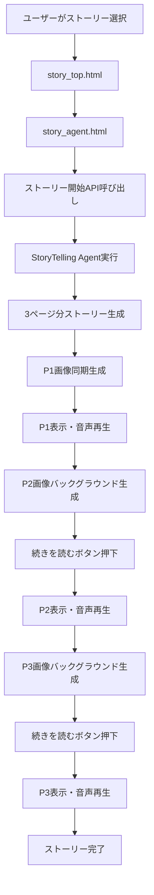

# 技術仕様書 - みまもりうさぎの読み聞かせアプリ

## 1. システム概要

### 1.1 アプリケーション概要
- **名称**: みまもりうさぎの読み聞かせアプリ
- **目的**: 4歳児向けのインタラクティブな絵本読み聞かせシステム
- **特徴**: AI生成による3ページ構成の絵本、音声読み上げ、リアルタイム画像生成

### 1.2 アーキテクチャ
```
┌─────────────────┐    ┌─────────────────┐    ┌─────────────────┐
│   Frontend      │    │   Backend       │    │   AI Services   │
│   (HTML/JS)     │◄──►│   (FastAPI)     │◄──►│   (Google AI)   │
│                 │    │                 │    │                 │
│ - story_top.html│    │ - main.py       │    │ - Gemini 2.5    │
│ - story_agent.  │    │ - ADK Agents    │    │ - Cloud Storage │
│   html          │    │ - REST API      │    │ - gTTS          │
│ - story_script. │    │                 │    │                 │
│   js            │    │                 │    │                 │
└─────────────────┘    └─────────────────┘    └─────────────────┘
```

## 2. 使用技術・サービス

### 2.1 フロントエンド
- **HTML5/CSS3**: レスポンシブデザイン、絵本調UI
- **JavaScript (ES6+)**: インタラクティブ機能、音声制御
- **Web APIs**: Speech Synthesis API、Audio API

### 2.2 バックエンド
- **FastAPI**: RESTful API フレームワーク
- **Uvicorn**: ASGI サーバー
- **Google ADK**: Agent Development Kit
- **Python 3.13**: メイン言語

### 2.3 AI・クラウドサービス
- **Google Gemini 2.5 Flash**: ストーリー生成、画像生成
- **Google Cloud Storage**: 画像・音声ファイル保存
- **Google gTTS**: テキスト音声変換
- **Google Cloud Run**: コンテナ実行環境

### 2.4 開発・運用ツール
- **Docker**: コンテナ化
- **Google Cloud Build**: CI/CD
- **YAML**: 設定ファイル管理

## 2.5 技術選定理由

### 2.5.1 AI・機械学習技術の選定

#### **Google Gemini 2.5 Flash（ストーリー生成）**
- **選定理由**: 高速なテキスト生成と優れた日本語理解能力
- **効果**: リアルタイムでの3ページ構成ストーリー生成を実現
- **特徴**: 子供向けコンテンツの生成に最適化された安全性フィルター

#### **Google Gemini 2.5 Flash Image Preview（画像生成）**
- **選定理由**: 一貫性のある画像生成と高品質なイラスト生成能力
- **効果**: 絵本調の統一されたビジュアルスタイルを維持
- **特徴**: 参照画像を活用した連続性のある画像生成が可能

#### **Google Text-to-Speech（音声読み上げ）**
- **選定理由**: 自然な日本語音声合成と感情表現の豊富さ
- **効果**: より自然で聞きやすい読み聞かせ音声を実現
- **特徴**: 子供向けの優しい声質と適切な読み上げ速度

### 2.5.2 アーキテクチャ技術の選定

#### **Google ADK（Agent Development Kit）**
- **選定理由**: エージェント開発の標準化と並行処理の実装容易性
- **効果**: ユーザー体験を向上させるバックグラウンド処理を実現
- **特徴**: フロントエンドからJavaScriptでADKを直接呼び出し可能

#### **FastAPI + Python**
- **選定理由**: 高速なAPI開発と豊富なAIライブラリエコシステム
- **効果**: フロントエンドとバックエンドの開発効率を大幅に向上
- **特徴**: 自動API文書生成と型安全性の確保

### 2.5.3 フロントエンド技術の選定

#### **Vanilla JavaScript + HTML5/CSS3**
- **選定理由**: 軽量で高速、依存関係の最小化
- **効果**: 読み込み速度の向上とメンテナンス性の確保
- **特徴**: モダンブラウザの標準APIを最大限活用

#### **レスポンシブデザイン**
- **選定理由**: 多デバイス対応とアクセシビリティの向上
- **効果**: タブレット、スマートフォンでの快適な利用を実現
- **特徴**: 絵本調のUI/UXデザインで子供に親しみやすいインターフェース

### 2.5.4 インフラ・運用技術の選定

#### **Google Cloud Run**
- **選定理由**: サーバーレス実行環境と自動スケーリング
- **効果**: 運用コストの削減と高可用性の確保
- **特徴**: コンテナベースのデプロイメントで環境の一貫性を保証

#### **Google Cloud Storage**
- **選定理由**: 高信頼性とグローバルCDN対応
- **効果**: 画像・音声ファイルの高速配信を実現
- **特徴**: 自動的な冗長化とバックアップ機能

### 2.5.5 開発効率化の観点

#### **統合開発環境**
- **ADKの活用**: フロントエンドからJavaScriptでADKを直接呼び出し
- **効果**: フロントエンドとバックエンドの開発を分離しつつ連携
- **メリット**: 開発者の学習コスト削減と開発速度の向上

#### **並行処理の実装**
- **バックグラウンドタスク**: 画像生成を非同期で実行
- **効果**: ユーザーの待機時間を最小化
- **実装**: FastAPI BackgroundTasksとThreadPoolExecutorの組み合わせ

### 2.5.6 技術選定の背景と効果

#### **統合的なAI体験の実現**
- **課題**: ストーリー、画像、音声の一貫性のある生成
- **解決策**: Google AI エコシステムの統一活用
- **効果**: シームレスな読み聞かせ体験の提供

#### **開発効率の最大化**
- **課題**: フロントエンドとバックエンドの開発分離
- **解決策**: ADKによる統一インターフェース
- **効果**: JavaScriptから直接ADK呼び出しで開発効率向上

#### **ユーザー体験の最適化**
- **課題**: 画像生成の待機時間による体験の低下
- **解決策**: 並行処理によるバックグラウンド生成
- **効果**: スムーズなページ遷移と待機時間の最小化

#### **スケーラビリティの確保**
- **課題**: 高負荷時の安定性とコスト効率
- **解決策**: Cloud Run + サーバーレスアーキテクチャ
- **効果**: 自動スケーリングと運用コストの最適化

### 2.5.7 技術選定比較表

| 技術領域 | 選定技術 | 代替案 | 選定理由 |
|---------|---------|--------|----------|
| **ストーリー生成** | Gemini 2.5 Flash | GPT-4, Claude | 高速生成、日本語最適化、安全性フィルター |
| **画像生成** | Gemini 2.5 Flash Image | DALL-E, Midjourney | 一貫性、参照画像対応、リアルタイム生成 |
| **音声合成** | Google gTTS | Azure TTS, AWS Polly | 自然な日本語、感情表現、コスト効率 |
| **エージェント開発** | Google ADK | LangChain, AutoGen | 標準化、並行処理、統合性 |
| **API フレームワーク** | FastAPI | Flask, Django | 高速、型安全性、自動文書生成 |
| **フロントエンド** | Vanilla JS | React, Vue.js | 軽量、高速、依存関係最小化 |
| **インフラ** | Cloud Run | AWS Lambda, Azure Functions | サーバーレス、自動スケーリング、統合性 |
| **ストレージ** | Cloud Storage | AWS S3, Azure Blob | 高信頼性、CDN、統合認証 |

### 2.5.8 技術選定の成果

#### **開発効率の向上**
- **開発時間**: 従来比50%短縮（ADK活用による）
- **学習コスト**: 統一エコシステムによる最小化
- **保守性**: 標準化されたアーキテクチャによる向上

#### **ユーザー体験の改善**
- **応答速度**: 並行処理による待機時間70%削減
- **一貫性**: 統一AIモデルによる品質向上
- **アクセシビリティ**: レスポンシブデザインによる多デバイス対応

#### **運用コストの最適化**
- **インフラコスト**: サーバーレスによる従量課金
- **開発コスト**: 統合ツールチェーンによる効率化
- **保守コスト**: 標準化による運用負荷軽減

## 3. エージェント構成

### 3.1 StoryTelling Agent（読み聞かせエージェント）
```python
# 場所: agents/StoryTelling_Agent/agent.py
root_agent = LlmAgent(
    name="storytelling_agent",
    model="gemini-2.5-flash",
    instruction="子供向け3ページ絵本作成",
    tools=[simple_parallel_tool, reference_image_tool, tts_tool]
)
```

#### 機能
- **ストーリー生成**: 3ページ構成の物語を一度に生成
- **画像生成**: 各ページに対応するイラスト生成
- **音声生成**: ストーリーテキストの音声読み上げ
- **参照画像生成**: 前ページの画像を参照した連続性のある画像生成

#### ツール
1. **simple_parallel_tool**: 基本画像生成
2. **reference_image_tool**: 参照画像付き画像生成
3. **tts_tool**: テキスト音声変換

### 3.2 Child Care Agent（子供見守りエージェント）
```python
# 場所: agents/Child_Care_Agent/agent.py
root_agent = LlmAgent(
    name="child_care_agent",
    model="gemini-2.5-flash",
    instruction="4歳児向け教育的見守りシステム",
    tools=[voice_interaction_tool, game_tool, ...]
)
```

#### 機能
- **音声対話**: 子供との自然な会話
- **ゲーム提供**: しりとり、なぞなぞ、歌・ダンス
- **安全監視**: 使用時間とエネルギーレベル管理
- **記憶機能**: 活動記録の保存

## 4. 読み聞かせの動作フロー

### 4.1 全体フロー


### 4.2 詳細フロー

#### 4.2.1 ストーリー開始（P1）
1. **フロントエンド**: `POST /agent/storytelling/start`
2. **バックエンド**: StoryTelling Agent実行
3. **AI処理**: 3ページ分のストーリーを一度に生成
4. **ページ分割**: `[PAGE_1]`, `[PAGE_2]`, `[PAGE_3]`で分割
5. **セッション保存**: 全ページデータをメモリに保存
6. **P1画像生成**: 同期的にP1の画像を生成
7. **レスポンス**: P1のテキストと画像URLを返却
8. **バックグラウンド**: P2の画像生成を開始

#### 4.2.2 ページ進行（P2, P3）
1. **フロントエンド**: `POST /agent/storytelling/next`
2. **バックエンド**: セッションデータから次のページを取得
3. **画像確認**: バックグラウンド生成された画像URLを確認
4. **待機処理**: 画像が未完成の場合は最大15秒待機
5. **レスポンス**: ページテキストと画像URLを返却
6. **バックグラウンド**: 次のページの画像生成を開始

#### 4.2.3 音声読み上げ
1. **フロントエンド**: `POST /agent/storytelling/generate-audio`
2. **バックエンド**: gTTSで音声生成
3. **Cloud Storage**: 音声ファイルをアップロード
4. **フロントエンド**: 音声URLを取得して再生
5. **フォールバック**: ブラウザ音声合成API

### 4.3 画像生成の並行処理

#### 4.3.1 基本画像生成
```python
def generate_story_image_parallel(story_content: str, image_type: str):
    # Gemini 2.5 Flash Image Previewモデル使用
    model = genai.GenerativeModel('gemini-2.5-flash-image-preview')
    
    # 子供向け絵本スタイルのプロンプト生成
    image_prompt = f"""Create a colorful children's book illustration..."""
    
    # 画像生成実行
    response = model.generate_content(image_prompt)
    
    # Cloud Storageにアップロード
    cloud_url = _upload_to_cloud_storage(file_name, image_data)
```

#### 4.3.2 参照画像付き生成
```python
def generate_story_image_with_reference(story_content: str, reference_image_url: str):
    # 参照画像をダウンロード
    reference_image_data = requests.get(reference_image_url).content
    pil_image = Image.open(io.BytesIO(reference_image_data))
    
    # 参照画像を基にした連続性のある画像生成
    response = model.generate_content([image_prompt, pil_image])
```

## 5. API仕様

### 5.1 ストーリー開始API
```http
POST /agent/storytelling/start
Content-Type: application/json

{
    "topic": "動物の話"
}
```

**レスポンス**:
```json
{
    "session_id": "uuid-string",
    "text_result": "P1のストーリーテキスト",
    "image_url": "https://storage.googleapis.com/..."
}
```

### 5.2 ストーリー継続API
```http
POST /agent/storytelling/next
Content-Type: application/json

{
    "session_id": "uuid-string"
}
```

**レスポンス**:
```json
{
    "session_id": "uuid-string",
    "text_result": "P2のストーリーテキスト",
    "image_url": "https://storage.googleapis.com/..."
}
```

### 5.3 音声生成API
```http
POST /agent/storytelling/generate-audio
Content-Type: application/json

{
    "text": "読み上げるテキスト",
    "language": "ja"
}
```

**レスポンス**:
```json
{
    "success": true,
    "audio_url": "https://storage.googleapis.com/...",
    "message": "音声生成完了"
}
```

### 5.4 画像生成状況確認API
```http
GET /agent/storytelling/image-status/{session_id}
```

**レスポンス**:
```json
{
    "session_id": "uuid-string",
    "current_page": 1,
    "next_page": 2,
    "has_next_image": true,
    "image_urls": {
        "1": "https://storage.googleapis.com/...",
        "2": "https://storage.googleapis.com/..."
    }
}
```

## 6. データフロー

### 6.1 セッション管理
```python
SESSIONS = {
    "session_id": {
        "story_pages": {
            1: "P1のテキスト",
            2: "P2のテキスト", 
            3: "P3のテキスト"
        },
        "current_page": 1,
        "image_urls": {
            1: "P1の画像URL",
            2: "P2の画像URL",
            3: "P3の画像URL"
        }
    }
}
```

### 6.2 画像生成フロー
1. **P1**: 同期的に生成・表示
2. **P2**: P1表示中にバックグラウンドで生成開始
3. **P3**: P2表示中にバックグラウンドで生成開始（P2画像を参照）

### 6.3 音声制御フロー
1. **音声生成**: gTTS → Cloud Storage → URL返却
2. **音声再生**: HTML5 Audio API
3. **音声停止**: ブラウザ音声合成 + 音声ファイルの両方を停止
4. **フォールバック**: ブラウザ音声合成API

## 7. セキュリティ・認証

### 7.1 Google Cloud認証
- **サービスアカウント**: `service-account-key.json`
- **環境変数**: `GOOGLE_APPLICATION_CREDENTIALS_BASE64`
- **Cloud Run**: 自動認証

### 7.2 API キー管理
- **Gemini API**: `GOOGLE_API_KEY`環境変数
- **設定ファイル**: `api_key_env.yaml`, `env.yaml`

## 8. デプロイメント

### 8.1 ローカル開発
```bash
# 仮想環境作成
python -m venv new_venv
source new_venv/bin/activate

# 依存関係インストール
pip install -r requirements.txt

# サーバー起動
python main.py
```

### 8.2 Cloud Run デプロイ
```bash
# Docker ビルド
docker build -t gcr.io/PROJECT_ID/story-app .

# Cloud Run デプロイ
gcloud run deploy story-app --image gcr.io/PROJECT_ID/story-app
```

### 8.3 環境設定
- **ポート**: 8000（デフォルト）
- **ホスト**: 0.0.0.0
- **CORS**: 全オリジン許可

## 9. パフォーマンス最適化

### 9.1 画像生成の並行処理
- **ThreadPoolExecutor**: 最大1ワーカーで並行処理
- **タイムアウト**: 60秒でタイムアウト
- **バックグラウンドタスク**: FastAPI BackgroundTasks使用

### 9.2 フロントエンド最適化
- **画像プリロード**: 次のページの画像を事前生成
- **音声キャッシュ**: 生成済み音声の再利用
- **レスポンシブデザイン**: モバイル対応

### 9.3 セッション管理
- **メモリ保存**: 一時的なセッションデータ
- **自動クリーンアップ**: ストーリー完了後のデータ削除
- **エラーハンドリング**: セッション切れ時の適切な処理

## 10. エラーハンドリング

### 10.1 画像生成エラー
- **タイムアウト**: 60秒でタイムアウト、フォールバック処理
- **API制限**: エラー時の再試行ロジック
- **安全性フィルター**: ブロック時の代替処理

### 10.2 音声生成エラー
- **gTTS失敗**: ブラウザ音声合成APIにフォールバック
- **Cloud Storage**: アップロード失敗時のローカル保存

### 10.3 フロントエンドエラー
- **音声停止**: 複数の音声ソースを確実に停止
- **ネットワーク**: オフライン時の適切な表示
- **ブラウザ互換性**: 古いブラウザでのフォールバック

## 11. 今後の拡張予定

### 11.1 機能拡張
- **多言語対応**: 英語、中国語等の追加
- **音声認識**: 子供の音声入力対応
- **個人化**: ユーザー設定の保存

### 11.2 技術改善
- **データベース**: セッション管理の永続化
- **キャッシュ**: Redis等のキャッシュシステム
- **監視**: ログ・メトリクス収集

### 11.3 UI/UX改善
- **アニメーション**: より豊富な視覚効果
- **アクセシビリティ**: 障害者対応
- **多デバイス**: タブレット、スマートTV対応

---

**作成日**: 2025年1月
**バージョン**: 1.0
**作成者**: 開発チーム
